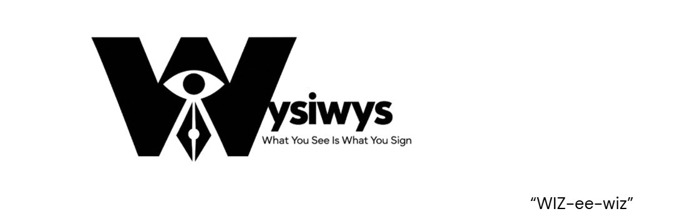
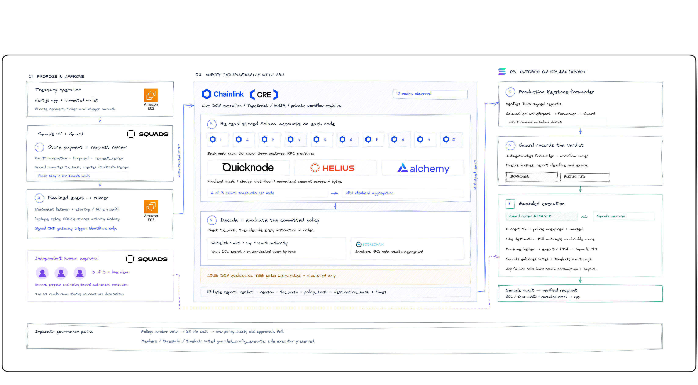
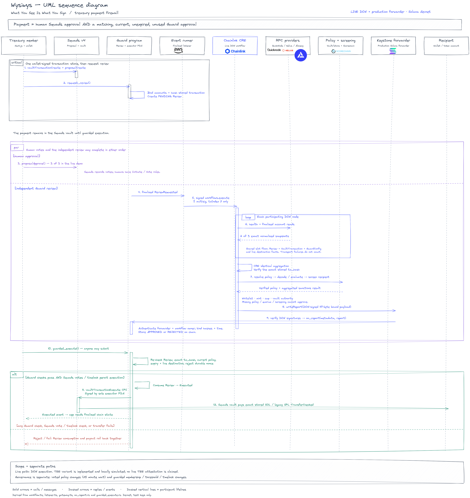

<div align="center">
  
  <h1>Wysiwys</h1>
  <p><strong>A Treasury Payment Firewall for Solana</strong></p>
  <p>
    <a href="https://solana.com"></a>
    <a href="https://chain.link/cre"></a>
    <a href="https://squads.so"></a>
    <a href="https://www.anchor-lang.com"></a>
    <a href="https://nextjs.org"></a>
  </p>
  <p>A Squads payment executes only when human signers approve it and Chainlink CRE approves the exact stored transaction under the treasury's policy.</p>
  <p>
    <a href="https://app.13-250-78-41.sslip.io">Live demo</a> &middot;
    <a href="docs/chainlink/README.md">Chainlink judge guide</a> &middot;
    <a href="evidence/cre/2026-10-07-live-don-e2e.md">Live DON evidence</a> &middot;
    <a href="docs/production-gaps.md">Production gaps</a>
  </p>
  <p><sub>Devnet, test keys only. Built for the TOKEN2049 Origins Hackathon.</sub></p>
</div>

---

## Overview

**What You See Is What You Sign.** Wysiwys checks what a treasury payment actually does before funds leave the vault.

A convincing browser preview, invoice or lookalike address cannot authorize a payout. Chainlink CRE re-reads the transaction stored in Squads through three RPC providers, decodes its instructions and checks the destination, token, amount and sanctions screening against the treasury's policy. An on-chain Guard enforces the result at execution.

```text
Payment executes = Human approval AND a matching, current, unexpired, unused APPROVED Guard review
```

Human votes and the review can arrive in either order. A CRE verdict does not cast a Squads vote. The Guard's executor PDA is the sole member with Execute permission, so payment execution passes through the on-chain checks.

---

## Core stack

- **Guard: Anchor / Rust** checks the review, transaction hash, policy and live destination before a Squads execution CPI.
- **Multisig: Squads v4** stores transactions and enforces the treasury's human approval threshold and timelock.
- **Verification: Chainlink CRE / TypeScript** orchestrates RPC agreement, deterministic decoding, policy evaluation, screening and report delivery.
- **Event adapter: Node.js / SQLite** observes finalized Guard events, triggers CRE and serves activity history and settlement instructions.
- **Frontend: Next.js / Tailwind / shadcn/ui** connects browser wallets and shows decoded payments, votes and on-chain review status.

## Independent verification

Wysiwys separates **data-source agreement**, **DON consensus** and **human approval**:

1. **Within each CRE node:** read QuickNode, Helius and Alchemy. Require a 2-of-3 exact match of validated account contents before decoding.
2. **Across CRE nodes:** use CRE consensus to aggregate node observations. Recorded live executions show **10 DON nodes**, each using the same three providers. The workflow does not set the DON size.
3. **Within the treasury:** Squads enforces the human threshold. The demonstrated live treasury uses **3 of 3** signers, separate from DON operators.

The decoder and policy are deterministic. Unknown instructions, unsupported features, missing inputs and unavailable screening fail closed. There is no AI in the payment decision path.

---

## Architecture & workflow

<div align="center">
  <a href="docs/diagrams/wysiwys_final_diagram.png">
    
  </a>
  <p><sub>Click the diagram to view it at full resolution.</sub></p>
</div>

1. **Propose:** a member signs a transaction that creates the Squads vault transaction and proposal and requests a Guard review. The Guard hashes the stored transaction on-chain.
2. **Trigger:** the runner observes the finalized `ReviewRequested` event and sends an authenticated CRE HTTP trigger containing identifiers only.
3. **Read and agree:** CRE nodes independently read the required accounts, require provider agreement and aggregate observations through CRE consensus.
4. **Decode and evaluate:** decode the stored message and apply the committed policy, including destination whitelist, allowed programs and instructions, mint, per-payment cap and Scorechain sanctions screening.
5. **Record:** a DON-signed report goes through the production Keystone Forwarder to Guard `on_report`, which authenticates delivery and stores APPROVED or REJECTED.
6. **Approve:** treasury members vote in Squads. This can happen before, during or after the CRE review.
7. **Execute:** anyone may submit `guarded_execute`. The Guard re-checks the exact transaction, current policy, expiry and live destination, then executes through Squads using its executor PDA. A failed vote check or transfer rolls back both review consumption and payout.

Policy changes follow a separate, voted governance path with a waiting period of at least five minutes on devnet. Changing the policy commitment invalidates approvals under the previous policy.

### UML sequence diagram

<details>
  <summary><strong>Expand the complete proposal, review and execution sequence</strong></summary>

<div align="center">
  <a href="docs/diagrams/wysiwys_uml_final.png">
    
  </a>
  <p><sub>Click the diagram to view it at full resolution.</sub></p>
</div>

</details>

---

## Chainlink integration & confidential execution

**Demonstrated live:** CRE review on a DON, ten observed nodes, three-provider reads, consensus, policy evaluation, sanctions screening and Solana report delivery through the production Keystone Forwarder. The recorded devnet flow includes approved payments and rejected lookalike destinations.

**Implemented and locally simulated:** a Confidential Workflow handler that evaluates the policy inside an AWS Nitro TEE enclave and returns a minimal, transaction-bound verdict. Live TEE execution and attestation have not been demonstrated. The current live workflow uses `execution: "don"`; secrets are kept out of public source and reports, but DON operators can see policy data at runtime.

Read the [Chainlink judge guide](docs/chainlink/README.md) for implementation details, code references, evidence and developer feedback, including the Solana event-adapter workaround.

## Demo scenarios

| Scenario | Expected result |
| --- | --- |
| Whitelisted payment within the cap | APPROVED; executes once after human approval |
| Lookalike or non-whitelisted recipient | REJECTED |
| Hidden authority change or nonce instruction in a payout | DENY |
| Destination token-account ownership changes after approval | Execution fails |
| Guarded execution submitted with a durable nonce | Execution fails |

The MVP supports **one System SOL transfer or one legacy SPL Token `TransferChecked`** to an existing destination account. mUSD is the devnet demo token. Amounts use integer base units; limits are per payment.

---

## Repository structure

| Path | Purpose |
| --- | --- |
| `programs/wysiwys_guard/` | Anchor Guard and executor PDA |
| `packages/shared/` | Shared seeds, hashes, report layout, schemas and IDL |
| `packages/decoder/` | Deterministic transaction decoder and policy |
| `workflow/confidential-preflight/review/` | CRE review workflow and tests |
| `services/runner/` | Finalized event adapter, CRE triggers and SQLite history |
| `app/` | Next.js treasury dashboard and wallet flows |
| `scripts/` | Bootstrap, scenario builders and devnet verification |
| `deployments/` | Deployment addresses and treasury configuration |
| `docs/` | Architecture, Chainlink guide, diagrams and security notes |
| `evidence/` | Simulation logs and live execution evidence |

## Quick start

### Prerequisites

- **Node.js 22.13+** and npm for the app, runner and workspaces.
- **Bun** for the isolated CRE review project; **CRE CLI** for workflow simulation.
- **Rust, Solana CLI and Anchor CLI** for Guard development. Rust is pinned in `rust-toolchain.toml`; use Linux or WSL for the Solana toolchain.
- A browser wallet configured for **Solana devnet** to use the app.

### 1) Install dependencies

Run from the repository root:

```bash
npm install
```

For the CRE review project:

```bash
cd workflow/confidential-preflight/review
bun install
```

### 2) Configure the app and runner

Copy `.env.example` to `.env` and `app/.env.example` to `app/.env.local`, then configure the values below. The [EC2 runner template](deploy/ec2/runner.env.example) also documents live gateway settings.

| Component | Configuration |
| --- | --- |
| App | `SOLANA_RPC_URL`, `WYSIWYS_DEPLOYMENT_PATH`, `WYSIWYS_SETTLEMENT_URL`, `WYSIWYS_SETTLEMENT_TOKEN` |
| Runner | RPC/WebSocket endpoints, `SETTLEMENT_TOKEN` and review-trigger settings |
| Live CRE trigger | `CRE_WORKFLOW_ID`, `CRE_GATEWAY_PRIVATE_KEY`; see the [review workflow guide](workflow/confidential-preflight/review/README.md) |

For a local app and runner, use `http://127.0.0.1:8787` as the settlement URL and set the app's `WYSIWYS_SETTLEMENT_TOKEN` equal to the runner's `SETTLEMENT_TOKEN`. All credentials stay server-side; keep real environment files, signing keys and private policy documents out of Git.

The demonstrated live treasury is described by [`deployments/devnet.live.json`](deployments/devnet.live.json). Point the app's `WYSIWYS_DEPLOYMENT_PATH` at `../deployments/devnet.live.json` to inspect it. The original treasury in `deployments/devnet.json` uses the simulator mock forwarder; its results are separate from live DON evidence. Match the runner configuration to the treasury you use.

### 3) Start the runner and frontend

From the repository root, in separate terminals:

```bash
# Event adapter and settlement service: http://localhost:8787
npm run dev --workspace=services/runner
```

```bash
# Frontend: http://localhost:3000
npm run dev --workspace=app
```

Running the frontend alone does not enable CRE reviews. Use the [app guide](app/README.md), [runner guide](services/runner/README.md) and [review workflow guide](workflow/confidential-preflight/review/README.md) for component setup and simulation targets.

---

## Testing

```bash
# TypeScript workspaces, from the repository root
npm run typecheck
npm test

# Guard tests on a local legacy validator
anchor test --validator legacy -- --features short-policy-delay
```

The `short-policy-delay` feature is for local tests only. Devnet uses the normal five-minute minimum.

The isolated CRE review project has its own checks:

```bash
cd workflow/confidential-preflight/review
bun run typecheck
bun test
```

## Evidence & documentation

- [Live DON end-to-end evidence](evidence/cre/2026-10-07-live-don-e2e.md): deployed workflow, report delivery and devnet transaction receipts.
- [Architecture verification](docs/diagrams/judge-architecture-live-notes.md): verified components, current state and evidence boundaries.
- [Design reference](docs/plans/architecture.md): architecture and component contracts.
- [Guard security checks](docs/security.md): execution gates, report authentication and linked tests.
- [Production gaps](docs/production-gaps.md): current risks and planned fixes.

## Security & current limits

Wysiwys is a **devnet hackathon build**. The Guard is unaudited, the upgrade authority remains with the deployer, and report provenance is bound to the configured workflow owner rather than a specific workflow ID. Live confidential execution remains pending.

The payment path currently excludes batches, account creation, Token-2022 and Address Lookup Tables. It has no daily budget counter or emergency bypass. Runner, RPC, screening or CRE failure blocks approval; on-chain state remains the source of truth.
