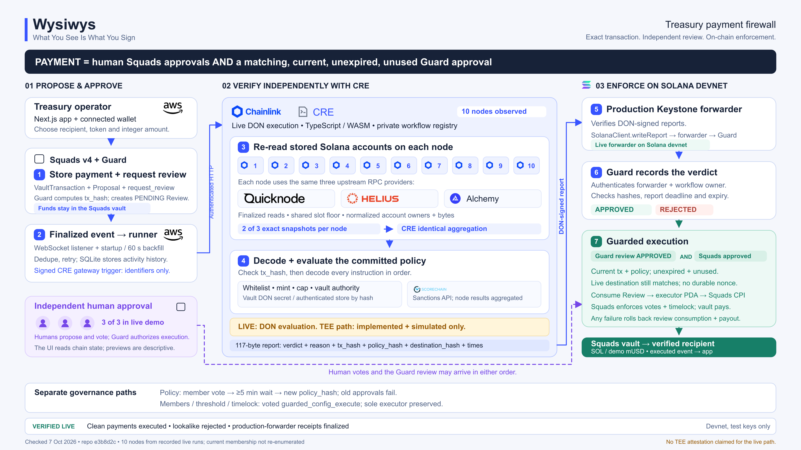

# Wysiwys: Chainlink judge guide

**What You See Is What You Sign.** Wysiwys is a treasury payment firewall for Solana. A Squads v4 payment executes only when the treasury's human signers approve it **and** an independent Chainlink CRE review approves the exact stored transaction under the current policy.

Our goal is to close the gap between the payment people believe they approved and the instructions that actually move their funds. A compromised interface, lookalike recipient or hidden authority-change instruction should not become executable just because the signers clicked Approve.

**Status, 7 October 2026:** live CRE review and production-forwarder delivery demonstrated on Solana devnet; 10 participating nodes recorded in live runs. The Confidential Workflow path is implemented and locally simulated, but the deployed review currently runs on DON nodes without a TEE. Devnet, test keys only.

[Editable diagram](../diagrams/wysiwys-judge-architecture-live.svg) · [Detailed architecture verification](../diagrams/judge-architecture-live-notes.md)

## How we use Chainlink

CRE provides the independent review and signed delivery path between a stored Solana transaction and our on-chain Guard. Human approval remains in Squads. The Guard is the only Squads Execute member and requires both approvals before it can authorize payment.

| Chainlink feature | Use in Wysiwys |
| --- | --- |
| CRE TypeScript / WASM workflow | Orchestrates chain observations, deterministic decoding, policy evaluation, screening and report submission. |
| Authenticated HTTP trigger | Accepts identifiers from our finalized Solana event adapter. The deployed trigger restricts callers using `authorizedKeys`. |
| Node-mode execution | Every node independently queries QuickNode, Helius and Alchemy through CRE's HTTP capability. |
| CRE consensus aggregation | Agrees on provider health and freshness context, account observations, fetched policy documents and screening results. |
| Vault DON secrets | Supplies RPC credentials, screening credentials and policy inputs without embedding their values in source or public reports. |
| CRE report generation + Solana Write | Produces a DON-signed verdict and submits it through the production Keystone forwarder to Guard `on_report`. |
| Confidential Workflows | Implements the enclave execution path for evaluating private policy data, including the recipient whitelist. This path is currently simulated. |

The provider comparison is application logic that we wrote. CRE supplies the network consensus and signing machinery. The runner starts a review; it cannot manufacture an APPROVED verdict or replace Squads votes.

## The CRE review workflow

### 1. Start from a stored transaction

The app stores a Squads `VaultTransaction` and `Proposal` and requests Guard review in the same wallet-signed transaction. Guard computes the canonical `tx_hash` from the stored account and creates a PENDING Review.

Our event adapter observes the finalized `ReviewRequested` event. It backfills on startup and every minute, deduplicates events and retries failed triggers. It calls the CRE gateway's `workflows.execute` method with an EVM-signed JWT binding the request body.

The trigger carries only `{ multisig, txIndex }`. The workflow derives the accounts and re-reads them. Browser previews, invoice claims and memo text never become authoritative payment facts.

### 2. Agree on Solana account contents

Each node checks the configured provider domains, devnet genesis and finalized slots. CRE aggregates a minimum context slot and per-provider health flags using median aggregation.

Account reads use `getMultipleAccounts` at `finalized`, with that shared minimum slot and provider eligibility mask. Responses are normalized into deterministic account-address, owner and data snapshots. A node needs **2 of 3 exact matching snapshots**; failed responses never count as agreement. CRE then uses `consensusIdenticalAggregation` to aggregate node outputs.

There are three separate approval/agreement mechanisms:

- **RPC source agreement:** 2 of 3 matching provider snapshots inside each node.
- **CRE network consensus:** agreement over node outputs using Chainlink's runtime.
- **Human approval:** the Squads member threshold, 3 of 3 in the live demo.

The recorded live runs involved 10 nodes. We do not set that number in the workflow or infer a numeric DON signing threshold from it. All nodes use the same three providers, so additional nodes do not create additional upstream provider fault domains. See [CRE's consensus model](https://docs.chain.link/cre/concepts/consensus-computing).

### 3. Decode and evaluate the actual payment

The workflow validates the Review, GuardConfig and stored transaction, verifies `tx_hash`, and decodes every instruction using our pure TypeScript `@wysiwys/decoder` package.

The narrow payment path supports one System SOL transfer or one legacy SPL Token `TransferChecked` to an existing destination token account. The committed policy checks permitted programs and instructions, vault authority, recipient wallet whitelist, mint/decimals and a per-payment amount cap. Extra, unknown or disallowed instructions cannot approve.

For SPL payments, the recipient is the token account's **wallet-owner authority**, not the Token program that owns its account data. This catches a whitelisted-looking token account controlled by another wallet.

Policy documents resolve by the treasury's current on-chain `policy_hash`. We first look for a matching document in the Vault DON secret registry. If none matches, the workflow fetches it from the authenticated policy store by hash and verifies the commitment, which also binds the decoder version. Live nodes must agree on the same fetched document. A missing, mismatched or unavailable policy blocks approval.

When screening is enabled, every live node calls Scorechain's sanctions API and CRE aggregates the results identically. Provider failures, missing policy and screening errors fail closed. No AI participates in decoding or deciding the verdict.

### 4. Deliver a bound, signed result to Solana

The workflow builds our fixed 117-byte report payload: verdict, reason code, `tx_hash`, `policy_hash`, action kind, `destination_hash`, issue time and expiry. Private whitelist entries and policy documents are excluded.

CRE generates the report and `SolanaClient.writeReport` submits it through the **production Keystone forwarder on Solana devnet**. The forwarder verifies DON signatures and CPIs into Guard `on_report`. Guard checks the configured forwarder state/program and signer PDA, workflow-owner metadata, Pending Review, matching hashes and time bounds before recording APPROVED or REJECTED. This follows Chainlink's [Solana Write model](https://docs.chain.link/cre/capabilities/solana-write).

The receiver currently authenticates the configured workflow owner rather than a specific workflow ID. Our simulator path uses a separate mock forwarder that skips DON signature verification; its evidence is kept separate from live delivery.

### 5. Enforce both approvals at execution

Votes and CRE review can arrive in either order. `guarded_execute` requires an APPROVED, unexpired, unused Review bound to the exact current transaction and policy. It rechecks the live destination account, including SPL mint, owner and initialized/non-frozen state, and rejects durable-nonce execution wrappers.

Guard marks the Review Executed, then signs the Squads execute CPI with its executor PDA. Squads enforces member approvals and timelock and authorizes the vault's transfer. A failure rolls back both Review consumption and payment. A CRE verdict alone is never a Squads vote or permission to execute directly.

## Confidential Workflow implementation

The private recipient whitelist is a business rule that we want to protect from node operators. Keeping it out of Git and putting it in a secret is useful, but ordinary DON execution still exposes the decrypted policy to the nodes processing it.

We therefore implemented a second execution path using `handlerInTee` and `TeeRuntime`, configured for **AWS Nitro in `us-west-2`**. The handler fetches policy/credential secrets at use time, resolves and evaluates the policy, and performs the screening HTTP request inside the enclave. It uses `runtime.usingTheDons()` for public chain observations and signed report generation/submission, passing only the derived bound verdict into the public report path.

| Boundary | Live `execution: don` | Confidential `execution: tee` |
| --- | --- | --- |
| Handler | `cre.handler` / `onReviewDon` | `cre.handlerInTee` / `onReview` |
| Sensitive policy evaluation | DON nodes | Enclave handler |
| Screening | Node-mode HTTP + CRE aggregation | HTTP inside the enclave |
| Public chain observations and report submission | DON runtime | DON runtime through `usingTheDons()` |
| Project evidence | Live deployment, report receipts and on-chain decisions | Local confidential simulation and tests |

**We do not claim live TEE execution or hardware attestation.** Confidential Workflow deployment requires separate private-beta enrollment; local development and simulation do not. Regular CRE deploy access does not automatically grant confidential access. A private workflow registry also does not imply enclave execution. [Confidential access requirements](https://docs.chain.link/cre/account/confidential-workflows-access).

The confidentiality target is private inputs and intermediate enclave data. Source code, the compiled workflow binary, public chain actions, reports and exported outputs are not automatically confidential. Production enclave logging must avoid sensitive values. Confidential Workflows are distinct from using Confidential HTTP for a single request. [Confidentiality boundary](https://docs.chain.link/cre/concepts/confidential-workflows).

## Evidence and code for judges

| Evidence | Result |
| --- | --- |
| Live clean payments, transaction indices 2 and 4 | APPROVED, human votes completed, then EXECUTED. |
| Live lookalike payment, transaction index 3 | REJECTED, reason 8: destination not whitelisted. |
| Ten-node live execution | Recorded provider-health disagreements and write-reply diagnostics across 10 nodes; a later clean run succeeded despite one node's QuickNode health failure. |
| Fresh chain verification, 7 Oct | Both clean Reviews Executed, lookalike Review Rejected, three report receipts finalized successfully, three human voters and Guard PDA as sole executor. |
| CRE review validation | 82 tests passed and workflow typecheck passed during the architecture review. |

Start with [live DON evidence](../../evidence/cre/2026-10-07-live-don-e2e.md), [latest recorded deployment](../../evidence/cre/2026-10-07-live-redeploy-policy-fetch.log), [fresh public verification](../../evidence/architecture/2026-10-07-live-verification.json), and [simulation evidence](../../evidence/cre/).

The verification session could not enumerate current deployments through this machine's CRE login, which returned no workflows. The node count and deployment status above are attributed to recorded live evidence, with on-chain outcomes verified separately. Use the treasury in [devnet.live.json](../../deployments/devnet.live.json) for the live demo; the original default treasury still has a simulator forwarder on chain.

Key implementation files:

- [CRE orchestration and both handlers](../../workflow/confidential-preflight/review/workflow.ts), [source quorum](../../workflow/confidential-preflight/review/rpc-quorum.ts), [review decisions](../../workflow/confidential-preflight/review/review-logic.ts), [live config](../../workflow/confidential-preflight/review/config.live.json).
- [Finalized listener](../../services/runner/src/listener.ts), [authenticated gateway trigger](../../services/runner/src/gateway.ts), [finalized delivery verification](../../services/runner/src/delivery.ts).
- [Guard report receiver](../../programs/wysiwys_guard/src/instructions/on_report.rs), [guarded execution](../../programs/wysiwys_guard/src/instructions/guarded_execute.rs), [shared report contract](../../packages/shared/src/report.ts), [policy commitment](../../packages/shared/src/policy.ts).

## Feedback for the Chainlink team

### Solana reads and native event triggers would remove substantial integration work

Our main friction was completing the Solana input side of the workflow. We could deliver DON-signed results through Solana Write, but used HTTP JSON-RPC for account reads and hosted an additional backend event listener to start reviews. That listener subscribes to Solana RPC logs, handles finality, reconnect/backfill, deduplication and retries, then authenticates an HTTP call to CRE. This adds infrastructure and an availability dependency simply to connect a Solana event to the workflow.

These are two separate gaps: **native account reads** would simplify the workflow's data acquisition; **a supported deployed Solana log trigger** would remove the external event-to-HTTP adapter. The current official [Solana Client reference](https://docs.chain.link/cre/reference/sdk/solana-client-ts) describes the supported release as write-only, with reads and log triggers in development. The SDK already contains generated read/log-trigger declarations, and the [CLI release history](https://docs.chain.link/changelog?product=CRE) mentions Solana LogTrigger simulation. Those interfaces and simulator support do not establish that the capability is enabled on our deployed target.

We would particularly value documented, deployable support for finalized Solana account reads and program-log triggers, with clear network/version availability and examples covering Anchor event decoding, minimum context slots and recovery after missed events. Native support would let us spend more time on the payment firewall and less on maintaining the event adapter. Our custom multi-provider comparison would remain a deliberate source-diversity policy wherever needed.

### Additional observations from our implementation

- **Make standard and confidential access easy to distinguish.** We could build the enclave path and deploy the regular workflow, but live confidential execution needs separate enrollment. A clear account-level capability/access matrix would make planning and demo claims easier.
- **Keep simulator and live response contracts aligned and explicit.** Our first live writes succeeded on chain, but our workflow initially reported failure because optional receiver fields present in simulation were absent in live replies. We corrected the checks and verify finalized Review state. Examples should distinguish successful submission from confirmed receiver execution.
- **Show multi-node API load early.** Health, account, policy and screening calls are multiplied across participating nodes. Provider rate limits produced node-specific failures that single-node simulation did not expose. A load estimate and realistic partial-provider-failure examples would help builders choose API plans and aggregation rules before deployment.
