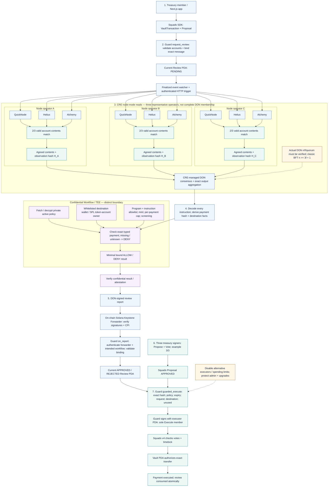

# Treasury Payment Firewall — complete coding-agent architecture

**Design review: 6 October 2026.** Scope: the treasury payment flow in the user's selected image, with three representative DON node operators, three RPC providers inside each operator, and a private whitelisted-address rule in the TEE. This is a proposed architecture, not verified application behavior or a frozen API contract.

The invariant is: **Squads human approval AND a matching, current, unexpired, unused APPROVED Guard review are required before money moves.** Votes and review may arrive in either order. A CRE verdict is neither a Squads vote nor permission for a human to execute directly.

## Instructions for the coding agent

Implement the revised treasury payment-review flow described here. Preserve existing project conventions and inspect the application's actual code and pinned dependencies before changing it. This document describes the intended behavior; it does not prove that any component is already implemented or deployed. The architecture diagram is a component/data-flow model, not an exact CRE SDK call graph.

Sections marked **PROPOSED** describe project-owned contracts that must be reconciled with the real code and versioned together before implementation. They are not official Chainlink or Squads APIs. Use official generated bindings and supported runtime APIs. Do not invent native trigger support, report-metadata offsets, enclave attestation, network membership, program IDs, approved wallets, policy values or deployment evidence.

### Narrow MVP

- Target Solana Devnet first, with a separately configured live DON/forwarder path when access is available.
- Support one reviewed payment instruction: System SOL transfer or legacy SPL Token `TransferChecked` for an explicitly configured test mint.
- Require a pre-existing, valid destination token account for SPL payments. Account creation and other extra instructions require a deliberate decoder/policy extension.
- Use off-chain memo/invoice metadata in the MVP. Adding an on-chain Memo instruction requires an explicit instruction allowlist and updated hash/decoder handling.
- Keep amounts in integer base units. The “50,000 USDC” diagram value is an example, not a configured limit or supplied mint address.
- Use three human voters with a 3/3 approval threshold in the example configuration. Human signers and DON node operators are separate roles.
- Add the private destination-wallet whitelist alongside program/instruction, mint and per-payment policy checks.

### Component responsibilities

| Component | Owns | Trust boundary |
| --- | --- | --- |
| Next.js frontend | Build proposals; show decoded previews, votes, review status and execution outcome | Browser input and displayed summaries cannot authorize payment |
| Squads SDK | Create the stored vault transaction/proposal and submit votes | Use the installed SDK and the actual Squads v4 account schema |
| Guard program | Review/config state; report authentication; execution checks; executor PDA signing | On-chain enforcement boundary |
| Squads v4 | Proposal, approval threshold, timelock and vault execution | Protocol behavior and permissions must be verified against the pinned deployment |
| Event adapter | Observe finalized review requests, deduplicate and authenticate CRE trigger requests | Supplies identifiers, not authoritative transaction contents |
| CRE workflow | Required account discovery, RPC comparison, trusted decoding and orchestration | Must re-read chain state; no browser-supplied payment facts as authority |
| Three RPC providers | Independent observations of Solana state | Assumed source fault domains; matching responses are not cryptographic proofs of ledger truth |
| Chainlink DON | Deployed network consensus and report signing | Actual membership/quorum are deployment facts, not chosen by drawing three cards |
| Confidential Workflow / TEE | Fetch private policy, evaluate typed actions, release a minimal verdict | Separate enclave boundary; actual confidential access and attestation are required |
| Keystone Forwarder | Verify DON signatures and CPI into Guard | On-chain Solana program; pin trusted program/state |
| Executor PDA | Program-controlled Squads Execute authority | Has no private key or callable service; Guard signs for it through CPI |
| Vault PDA + transfer program | Authorize and apply the reviewed payment | Squads authorizes the vault; System/SPL program performs the transfer |

### Proposed module boundaries

Use these responsibility boundaries within the repository's existing layout:

| Module | Responsibilities |
| --- | --- |
| Frontend | Proposal creation, account selection, preview, vote, request-review and guarded-execute actions |
| Guard program | Configuration, request head, review accounts, receiver and guarded execution |
| Shared transaction specification | Supported message schema, canonical encoding, hash domain, decoder version and cross-language fixtures |
| Event adapter | Finalized event observation, retry/deduplication and authorized HTTP triggering |
| CRE node callback | Three-provider fetch/validation, normalized observation and source quorum |
| CRE orchestration | DON output aggregation, decoding, confidential evaluation and report submission |
| Confidential policy module | Private policy loading, destination whitelist and other deterministic checks |
| Deployment/configuration | Network/program identities, protected authorities, secrets and environment separation |

## Architecture diagram

## Seven-stage explanation

1. **Propose payment:** the Next.js app uses the Squads SDK to create a VaultTransaction and Proposal. Recipient, mint and integer amount must be reflected in the stored message. Browser previews and memos cannot authorize payment.
2. **Request review:** Guard validates the expected multisig, vault, Squads account owners and derivations; computes the transaction binding; creates a current PENDING review; emits `ReviewRequested`. New requests supersede old generations; consumed transactions cannot regain authorization.
3. **Fetch and agree:** an authorized adapter observes the finalized event and sends an authenticated HTTP trigger. CRE re-reads the on-chain request and payment. Every illustrated node independently reads all three RPC providers, validates their responses, and returns a matching observation. CRE aggregates node outputs through its deployed consensus mechanisms. Native Solana event-trigger availability must be verified before replacing the adapter.
4. **Decode and evaluate:** decode every stored instruction with a pinned decoder. Pass the exact payment, destination facts and binding into confidential policy execution. Inside the TEE, fetch/decrypt the active private policy and evaluate its address whitelist and other rules.
5. **Store the verdict:** after the confidential result and attestation checks, the DON signs the bound report. The on-chain Keystone Forwarder verifies signatures and calls Guard `on_report` by CPI. Guard authenticates the delivery and intended workflow, rejects stale/mismatched reports, and records APPROVED or REJECTED. [Solana Write capability](https://docs.chain.link/cre/capabilities/solana-write).
6. **Human approval:** three treasury signers approve through Squads in the example configuration. They have Propose/Vote permissions; the Guard-derived executor PDA is the sole Execute member.
7. **Execute:** Guard checks every gate and the current transaction, revalidates mutable destination facts, consumes the review, and invokes Squads with the executor PDA signer. Squads checks approval/timelock and authorizes the vault transfer. Consumption and payout are one atomic transaction; failure rolls both back.

## Operator/RPC topology and the BFT correction

| Illustrated operator | Its three upstream reads |
| --- | --- |
| A | QuickNode + Helius + Alchemy |
| B | QuickNode + Helius + Alchemy |
| C | QuickNode + Helius + Alchemy |

Use **three different providers within each operator**, and use the **same provider trio across operators** as the baseline. Separate regional endpoints or credentials can be used where supported. Three URLs from one provider offer some availability benefits, but not three independent provider fault domains. Provider selection is configurable; these names are example endpoints, not a claim that deployment credentials already exist.

For one shared batched read set, the illustration contains nine upstream requests: three shown operators × three providers. With an actual DON of `n` executing nodes, that read set has `3n` requests before retries or additional discovery reads. Batch required addresses rather than issuing three calls per account.

**Inner check:** our application chooses a 2-of-3 exact content match among valid provider observations. This assumes no more than one of the three independent sources is wrong for that read. **Outer check:** CRE supplies the network consensus and configured output aggregation; do not implement an ad hoc 2-of-3 operator vote and call it DON BFT. The HTTP SDK supports a node-level callback with fetching/parsing logic before aggregation. The composed three-provider callback is this project's design, not a built-in CRE “three RPC” feature. [HTTP SDK](https://docs.chain.link/cre/reference/sdk/http-client-ts).

Three operators alone do not establish a one-Byzantine-fault guarantee. Classical asynchronous/partially synchronous BFT uses `n >= 3f + 1`, so tolerating `f = 1` requires at least four replicas under that model. Chainlink's deployed DON protocol, membership, fault bound and quorum must be confirmed; the three cards illustrate repeated work, not the complete production network. [Primary BFT reference, section 2.2](https://publications.csail.mit.edu/lcs/pubs/pdf/MIT-LCS-TR-817.pdf).

All three operators still depend on the same three upstream providers. Two colluding or identically incorrect providers can mislead every honest node. Extra operators protect against operator faults; they do not turn three sources into nine independent data sources.

## Data comparison and hashes

Read the required Guard/Squads accounts and relevant token/mint accounts at finalized commitment, preferably with `getMultipleAccounts`. Check transport and JSON-RPC errors, missing accounts, account owners, schema, expected addresses, lengths and freshness before counting a response. Use a shared minimum context floor. It is not an exact historical snapshot lock; inconsistent mutable state must lead to bounded retry or no APPROVED result. [Solana RPC](https://solana.com/docs/rpc/http/getmultipleaccounts).

Compare the required account content in a deterministic encoding, not JSON field order, request IDs, timestamps or the incidental RPC context slot. Validate slot evidence separately. Any slot/freshness information included in the exact DON output must follow an agreed deterministic normalization rule. Do not add node-local clocks or differing provider response slots to an identical-output aggregation and expect it to agree.

There are **two distinct hashes**. `H_A/H_B/H_C` represent each node's agreed **source observation**. The payment `tx_hash` binds the exact supported Squads stored message and its identity. Return the agreed account contents with the observation hash so downstream decoding uses the same data; a hash alone cannot be decoded. Pin a domain-separated encoding and decoder version shared by CRE and Guard. Include instruction order/data, program IDs, account keys and signer/writable flags, not just amount and recipient. Do not hash the whole mutable account envelope as the payment hash without analyzing fields that change during execution.

## Confidential whitelisted-address check

The policy rule is **allowed recipient wallets**, separate from allowed programs/instructions. No real approved wallet addresses were supplied; the allowed set remains configuration data.

For SOL, compare the decoded destination public key to the allowed wallet set. For SPL tokens, validate the destination account's owning token program, decode its mint and **token-account owner authority**, then check that wallet authority against the whitelist. The Solana account's program owner and the token account's wallet owner are different fields. Restrict the exact destination token account/ATA as well when the policy requires it. Validate source authority, mint, decimals and integer amount; never infer a recipient from a memo. [Token-account layout](https://solana.com/docs/tokens/basics/create-token-account).

The TEE also applies program **and instruction** allowlists, permitted mints, per-payment caps, screening rules, and blocks authority/nonce/unsupported actions. Missing private inputs, unresolved ownership or stale policy cannot produce ALLOW. Reject unhandled account creation, lookup tables, ephemeral signers, batches, Token-2022 extensions and arbitrary instructions in the narrow MVP.

Fetch/decrypt private policy values inside the enclave. Chain reads, triggers and writes stay on the normal DON path; confidential evaluation is a distinct execution boundary. Return only a minimal bound verdict for report signing. Keep the full whitelist out of source constants, public logs, reports and UI summaries. Confidential Workflows protect enclave inputs/intermediates; source code and public Solana payments remain visible. Deployment access and actual handler orchestration must be verified. [Confidential Workflows](https://docs.chain.link/cre/concepts/confidential-workflows).

Bind the validated destination token account, wallet owner and mint into the accepted review. Guard must require those facts still match at execution; an unchanged transfer instruction does not prove its token account still has the reviewed owner. A public policy version/commitment identifies the active rules, but a plain hash is not encryption.

## Proposed report and Guard checks

Finalize serialization, account seeds, sizes and versioning before coding. The report/review should bind: network/Guard domain; multisig/vault/transaction/index; unique request generation; exact transaction hash; policy and decoder versions; validated destination account/owner/mint; verdict/reason; issued time and bounded expiry; consumed state maintained on-chain. ALLOW maps to APPROVED; DENY maps to REJECTED. Pending, failed or indeterminate workflows never authorize execution.

Guard must pin the forwarder program/state and authenticate its derived signing authority. Separately verify the intended workflow provenance supported by the deployed Solana report/receiver path. A user-supplied `workflow_id` in the payload is not proof of origin. This provenance scheme remains an implementation gate. [Receiver and simulation guide](https://docs.chain.link/cre/guides/workflow/using-solana-client/onchain-write-ts).

At execution, check active policy/decoder, current request, exact message, validated destination facts, chain-clock expiry, unused status and pause state. Mark consumed before the Squads CPI in the same transaction. Expose no general-purpose PDA signing entry point. Protect Squads configuration, Guard upgrade authority and policy administration; disable spending-limit paths and additional executors that bypass the Guard.

The diagram claims per-payment caps only. Daily/cumulative caps require an authoritative reservation mechanism or on-chain counters updated atomically with payment; parallel off-chain approvals cannot reserve the same budget safely.

## Simulation versus deployed operation

Local CRE simulation uses a single-node consensus model; it can exercise three-provider application logic but cannot demonstrate a multi-node DON fault-tolerance guarantee. A deployed workflow performs real network consensus. [CRE consensus documentation](https://docs.chain.link/cre/concepts/consensus-computing).

The Solana write path exists in both environments with different trust setups: default simulation dry-runs through a mock forwarder; mock broadcast can create real Devnet state; deployed workflows use the live Keystone Forwarder and DON-signed reports. Keep mock/live forwarder configuration separate. A simulation success is not evidence of live DON signatures or confidential enclave attestation. [Official write guide](https://docs.chain.link/cre/guides/workflow/using-solana-client/onchain-write-ts).

## PROPOSED on-chain account model

Derive all project-owned PDAs under the Guard program. Final seeds, field sizes, enum values and serialization are intentionally not frozen here. Verify every supplied account's expected address, owner and role. Do not use caller-provided account labels or hashes as authority.

| Account | Scope | Required information |
| --- | --- | --- |
| `GuardConfig` | Multisig / treasury | Schema version; network domain; Guard/Squads identities; multisig/vault and vault index; executor identity/bump; active policy/decoder versions and commitments; trusted forwarder program/state; verified workflow authentication configuration; maximum review lifetime; pause flag; protected administration |
| `RequestHead` | Stored Squads transaction | Exact transaction identity; monotonically increasing request generation; current review address; permanent consumed/executed marker |
| `Review` | Transaction + request generation | Config/multisig/vault/transaction identity; payment `tx_hash`; policy/decoder versions; request time and deadline; verdict/reason; reviewed destination facts; issued/expiry times; accepted-report commitment; `used` flag |
| Squads `VaultTransaction` | Existing Squads transaction | Authoritative stored message and the expected transaction/vault derivation |
| Squads `Proposal` | Matching transaction index | Current approvals/status/timelock; validated through the supported Squads execution instruction |
| Source/destination token accounts and mint | SPL payment | Token-program ownership, mint, owner authority, decimals, state and supported authority/delegate conditions |

Retain a permanent consumed invariant in `RequestHead` or an equivalent mechanism. Closing/recreating a Review PDA, reusing an index or migrating accounts must not restore authorization for an executed payment.

## PROPOSED review-report contract

This is a logical schema, not an exact ABI. Encode it with the chosen versioned project format and the official Solana report wrapper/bindings.

| Field group | Required binding |
| --- | --- |
| Domain | Schema version, network/cluster identity, Guard program/config and Squads program |
| Request | Review identity, request generation, multisig, vault/index, stored transaction and proposal/index |
| Payment | Exact `tx_hash` from the pinned canonical-message encoding |
| Policy | Active policy version/commitment and decoder version/commitment |
| Destination facts | Supported action kind; destination account/wallet; for SPL, the reviewed owner authority, mint and token program |
| Result | ALLOW or DENY, stable reason code; optional safe public summary |
| Time | Agreed issued time and bounded expiry, constrained by the request deadline |

Use on-chain state for `used`; report senders cannot reset it. Do not put private wallet lists, private limits, screening inputs or secrets into the report. Report payload fields identify the intended workflow but do not independently authenticate it.

Bind mutable destination facts to the payment hash, request and active policy. Guard can then compare current token-account owner/mint/program to the reviewed values without receiving the private whitelist itself.

## PROPOSED Guard instruction contracts

### `request_review`

1. Require an authorized treasury requester under the chosen configuration, such as an expected Squads member with Propose permission. An arbitrary caller must not continuously supersede legitimate reviews.
2. Validate Guard config, expected Squads program, multisig, vault, stored transaction and proposal linkage. Reject paused, executed or unsupported state.
3. Decode the supported stored message sufficiently to compute its exact canonical binding on-chain. Ignore the proposer's claimed recipient/amount/hash as authority.
4. Increment the current request generation in `RequestHead`, create its Review PDA and store the active policy/decoder versions and fixed request deadline.
5. Set review status PENDING and `used = false`; emit the request's identities. A new controlled request supersedes prior generations.

### `on_report`

1. Authenticate the pinned forwarder program/state and derived signing authority. The documented authority derivation uses `["forwarder", forwarderState, receiverProgram]` under the trusted forwarder program; verify state ownership and signer status as well.
2. Authenticate the intended workflow using a verified mechanism supported by the deployed Solana report path. Do not borrow EVM metadata offsets or accept a payload workflow ID as proof.
3. Check schema/domain, request generation, exact account identities, payment hash and current policy/decoder bindings.
4. Check chain-clock time, permitted future-time tolerance, expiry, maximum lifetime and the original request deadline.
5. Accept a terminal verdict for the current unconsumed request only. An identical duplicate may be idempotent; it must not extend expiry, replace a conflicting verdict or reset consumption.
6. Store the bound destination facts and result. ALLOW becomes APPROVED; DENY becomes REJECTED. Emit a safe result event without private policy data.

### `guarded_execute`

1. Validate the complete expected account set and unpaused Guard configuration. A frontend button is not a permission boundary.
2. Require the current Review PDA/generation, APPROVED status, active policy/decoder, unexpired deadline and unused/permanently unconsumed transaction.
3. Recompute the exact current payment hash with the same canonical specification and compare it to the stored review.
4. Recheck policy-relevant mutable state. For SPL, validate current source vault authority, mint, token program and destination owner against the accepted review. Reject unsupported or unapproved alternate delegate/authority paths.
5. Confirm the expected executor PDA and supported Squads target. Expose no general-purpose arbitrary CPI or PDA-signing option.
6. Mark the review used and the transaction consumed, then invoke the supported Squads vault execution instruction with the Guard-derived executor PDA signer.
7. Let Squads enforce proposal approvals, status and timelock and sign for the vault. Any failed instruction rolls back consumption, optional counters and the transfer.

A fee-paying caller may submit `guarded_execute` if the final contract allows permissionless execution; that caller cannot change the stored payment or skip any gate.

### Administrative operations

Protect pause/unpause, policy/decoder updates, forwarder/workflow changes, migrations and Guard upgrades. Security-relevant configuration changes must invalidate outstanding approvals through a checked config generation or equivalent version binding. Protect Squads configuration so it cannot add another Execute member or spending-limit route. Validate treasury token accounts at onboarding for external delegates or other authorities able to move funds outside the Guard. Record the trust assumptions for upstream Squads program upgrades separately.

## Review lifecycle and failure handling

Persist verdict status and consumption separately; the exact account representation is a project decision.

| State shown to the user | Meaning | Can execute? |
| --- | --- | --- |
| PENDING | Current request has no accepted final verdict | No |
| APPROVED | Accepted ALLOW verdict exists | Only while every other gate passes |
| REJECTED | Accepted DENY verdict exists | No |
| EXPIRED | Review/request deadline has elapsed | No |
| STALE | Active policy/decoder/config differs from the accepted binding | No |
| SUPERSEDED | A newer request generation is current | No |
| INDETERMINATE / ERROR | RPC/decoding/TEE/workflow failure; operational status, not ALLOW | No |
| CONSUMED / EXECUTED | Atomic execution succeeded; permanent replay prevention applies | No further execution |

EXPIRED, STALE and SUPERSEDED can be derived from chain state. CONSUMED can be represented by `used` plus the permanent marker. Do not require a background job to revoke an expired approval; execution checks the chain clock directly.

RPC errors, no matching provider observations, unavailable DON/TEE, missing private policy, report rejection and retries must never fall back to ALLOW. Infrastructure failures may leave the request PENDING with an operational error instead of producing a signed policy DENY. In either case execution remains blocked. Retry notification delivery idempotently; a new review generation is an explicit controlled operation, not an automatic way to revive an expired or consumed approval.

## Configuration that must be supplied

Use explicit environment configuration for the target cluster, program IDs, multisig/vault, mint, forwarder state, authenticated trigger keys, provider endpoints, policy identity, review lifetime, authority custody and deployment access. Keep RPC credentials and confidential policy inputs in appropriate secret storage. None of those identities or actual whitelist entries should be inferred from the illustrative diagram.

Public configuration and private policy data must be distinguished. A configured source RPC key is operational access; a destination whitelist is a business rule; a forwarder/workflow authentication setting is a security boundary. Do not treat them as interchangeable secrets or trust signals.

## Open decisions to settle before live deployment

| Decision | Required outcome |
| --- | --- |
| Actual application/dependency state | Map this design to the real repository; verify pinned Squads and CRE behavior |
| DON deployment | Confirm access, capability support, membership/fault bound/quorum and the deployed workflow identity |
| Confidential execution | Verify access, accepted TEE/attestation policy, private-input source and supported normal-DON/enclave orchestration |
| Receiver provenance | Prove intended-workflow authentication for the actual Solana forwarder/metadata path; leave live approval disabled until resolved |
| Transaction binding | Freeze a domain-separated encoding, hash algorithm and cross-language fixtures compatible with Guard and the CRE runtime |
| Account/report ABI | Freeze PDA seeds, schema/enum versions, field sizes, receiver accounts and generated bindings |
| Source normalization | Define required account fields, context/freshness checks, identical-output aggregation and bounded retry behavior |
| Policy configuration | Supply actual whitelist entries, allowed mint/program/actions, caps, review lifetime and update authority |
| Permission closure | Verify sole executor, disabled spending limits, clean token authorities and protected admin/upgrade paths |

Implement and prove the narrow payment path first. Add richer instructions, daily caps or native triggers only when their decoder, atomic accounting, authentication and capability requirements are implemented and tested.

## Suggested implementation order

1. Inspect existing contracts and pin the canonical payment model with shared fixtures.
2. Configure a Devnet Squads multisig and Guard-derived sole executor; verify bypass closure.
3. Implement Guard request state, generation/replay rules and execution checks.
4. Implement and test the per-node three-provider observation callback and source quorum.
5. Integrate deployed CRE aggregation, pinned decoding and the separate confidential policy boundary.
6. Implement the authenticated Solana receiver/report path; keep mock and live configurations separate.
7. Connect proposal/vote/review/execute UI flows and the authenticated event adapter.
8. Run the acceptance matrix below and capture separate evidence for each environment before enabling live use.

## Checks for the coding agent

- A valid whitelisted payment executes once only after both approvals, regardless of arrival order.
- One conflicting provider may be outvoted; missing/error responses do not count as agreement. No source/DON quorum means no APPROVED result.
- Non-whitelisted wallets fail, including a whitelisted-looking token-account address controlled by another wallet. Wrong mint/program and changed destination ownership fail.
- Unknown instructions, wrong account derivations, modified message/amount/privileges and stale policy/decoder fail.
- Forged/direct report calls, wrong forwarder, unintended workflow, wrong network/request, expiry, replay and consumed reviews fail.
- Direct human execution and spending-limit bypasses fail. Missing votes/timelock or failed transfer leave no permanent review consumption.
- Keep separate evidence for provider-quorum tests, mock Devnet delivery, live DON consensus and TEE attestation.

## Mentor explanation

“Three people still control the treasury through Squads. Before a payment can execute, our Guard also requires an independent policy approval. Each illustrated oracle operator reads the same three independent Solana RPC providers and checks that the data matches. The actual Chainlink network then agrees across node outputs. A confidential workflow evaluates private rules, including approved recipient wallets, and returns a verdict tied to the exact payment. Chainlink delivers that verdict to our Solana Guard. Only when both the human votes and the fresh policy approval exist can the Guard authorize the payment.”

